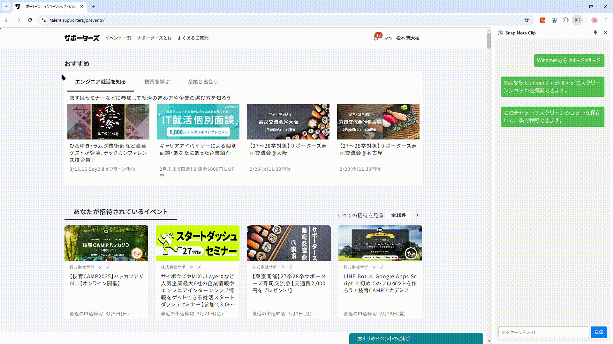
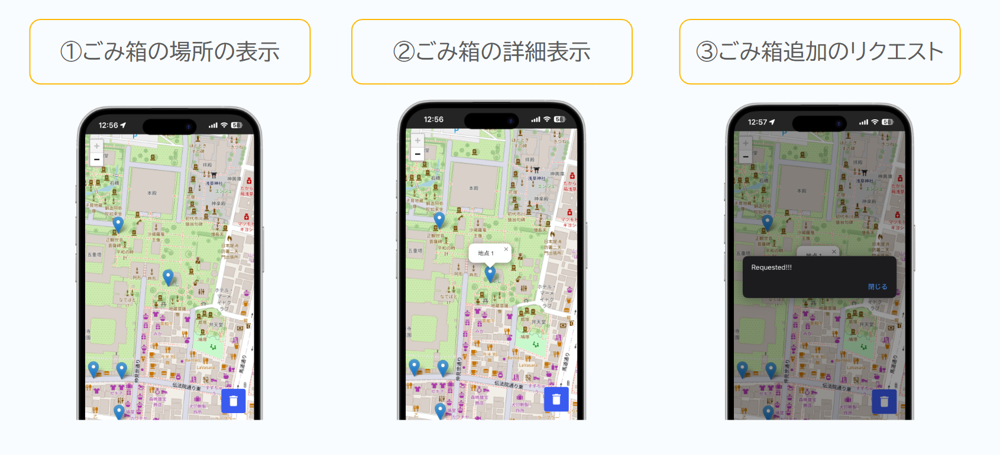
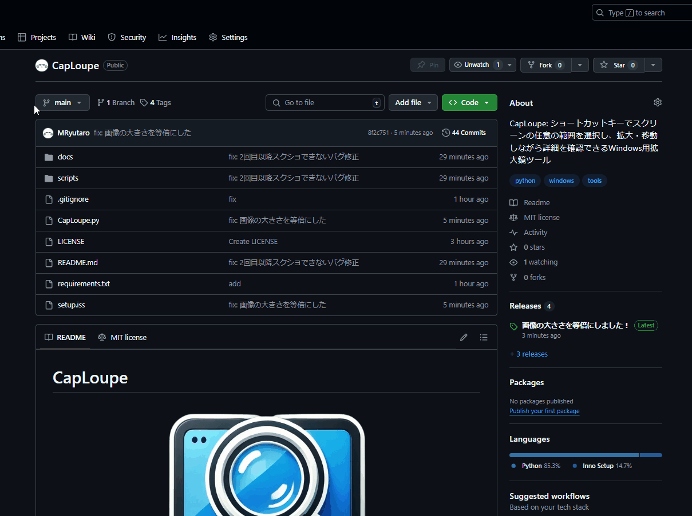

最終更新日：2025/12/12

<!-- 

  
  

  

 -->

## 🎓 経歴

| 期間 | 名前 | 状況 |
|:---|:---|:---|
| 2018年（平成30）4月～2021年（令和3年）3月 | [広島市立基町高等学校](https://www.motomachi-hs.jp/) | 卒業 |
| 2021年（令和3年）4月～2025年（令和7年）3月 | [大阪大学工学部電子情報工学科](http://school.eei.eng.osaka-u.ac.jp/) | 卒業 |
| 2025年（令和7年）4月～2027年（令和9年）3月 | [大阪大学大学院情報科学研究科](https://www.ist.osaka-u.ac.jp/japanese/) | 卒業見込み |

## 🏢 バイト・インターン

| 期間 | 名前 |
|:---|:---|
| 2021年（令和3年）4月～2022年（令和4年）3月 | [田中学習会](https://www.tanakagakushukai.com/) |
| 2022年（令和4年）4月～2023年（令和5年）3月 | [大阪ヒートクール株式会社](https://www.osaka-heat-cool.com/) |
| 2023年（令和5年）4月～2025年（令和7年）3月 | [くろねこラボ合同会社](https://www.knlab.co.jp/) |
| 2025年（令和7年）8月19日〜2025年（令和7年）8月29日 | [フリー株式会社](https://corp.freee.co.jp/) |
| 2025年（令和7年）4月～2025年（令和7年）10月現在 | [プラネットファーマソリューションズ株式会社](https://www.pp-solutions.jp/) |

## 📜 資格

| 年月 | 名前 |
|:---|:---|
| 2021年（令和3年）6月 | ITパスポート |
| 2022年（令和4年）3月 | 日商簿記検定試験3級 |
| 2024年（令和6年）4月 | TOEIC Listening & Reading Test 835点 |

## 🧪 研究

- 松本琉大桜，速水智教，髙橋慧智，伊達 進，“低運用コストを実現するJupyterHub向けクラウドバースティング技術”，情報処理学会OS研究会，2025年5月．

| レポジトリ | 説明 |
|:---|:---|
| [ElasticKernel](https://github.com/MRyutaro/ElasticKernel.git) | ElasticKernel: An IPython Kernel that automatically saves and restores Jupyter Notebook execution states. |

## 🚀 プロジェクト
### 📌 [LCA](https://tenbou.nies.go.jp/science/description/detail.php?id=57)分析用のシミュレーションツールのプロトタイプ開発
- React (React Flow, Jotai, MUIなど)
- Python (FastAPI, NumPy, NetworkXなど)

### 📌 学術情報レビュー・執筆支援AIツール[SophiaPanorama](https://sophiapanorama.pp-solutions.jp/)の開発
- Python (Flaskなど)
- AWS (ECS, ECR, RDSなど)

## 🏆 出場
### 📌 [2025 APAC HPC-AI Competition](https://www.hpcadvisorycouncil.com/events/2025/APAC-AI-HPC/)（2025年3月~10月）
6人のチームで参加し、Excellent HPC Performance賞を受賞しました！

プレスリリース
- 理研: [学生向け計算科学分野国際コンペティションで上位入賞](https://www.riken.jp/pr/news/2025/20251209_1/index.html)
- 大阪大学情報科学研究科: [学生向け計算科学分野国際コンペティションで上位入賞](https://www.ist.osaka-u.ac.jp/japanese/news/newsDetailNews.php?id=520)
- 伊達研究室: [2025 APAC HPC-AI Competitionにて本研究室学生チームが HPC部門Excellent HPC Performance 賞を受賞](https://www.ais.cmc.osaka-u.ac.jp/date/2025-apachpcai-award/)

### 📌 [技育CAMP2024 ハッカソン Vol.22](https://talent.supporterz.jp/events/21ff01e0-4e23-4758-9e08-b50c29c51860/)（2025年2月）

優秀賞を頂きました！

- Githubレポジトリは[こちら](https://github.com/MRyutaro/SnapNoteClip)
- 記事は[こちら](https://qiita.com/ryutarom128/items/6570a20bea69119de9bd)
- 発表用スライドは[こちら](https://speakerdeck.com/ryutarom/ji-yu-camp2024-vol-dot-22-snapnoteclip)

**使用した技術**
- JavaScript
- HTML
- CSS

### 📌 [Engineer Guild Hackathon 2024](https://event.gaishishukatsu.com/hackathon_2024_november)（2024年11月）

決勝に出場しました！

- Githubレポジトリは[こちら](https://github.com/MRyutaro/smago-map)
- 記事は[こちら](https://qiita.com/ryutarom128/items/f890cfeda6f515a2c4c8)
- 予選発表用スライドは[こちら](https://speakerdeck.com/ryutarom/egh-timu16)、決勝発表用スライドは[こちら](https://speakerdeck.com/ryutarom/engineer-guild-hackathon-2024-jue-sheng-timu16)

**使用した技術**
- Nginx
- React
- Python (FastAPI)
- Google Maps Platform
- Docker
- Cloudflare
- Raspberry Pi

## 🧑‍💻 個人・共同開発
### 📌 CapLoupe（2025年2月）

- GitHubレポジトリは[こちら](https://github.com/MRyutaro/CapLoupe)

**使用した技術**
- Python
- Inno Setup

### 📌 キル・デスした時刻を自動予測するゲーム解析用ツールspla3clip（2024年9月）

- 記事は[こちら](https://qiita.com/ryutarom128/items/2016c1567208ff38d461)
- GitHubレポジトリは[こちら](https://github.com/MRyutaro/splatoon3_highlight_collector)

**使用した技術**
- React (Jotai, MUI)
- Python (FastAPI, scikit-learn)

### 📌 カメラと両手のみを必要とする新たな入力システム（2024年1月）

- GitHubレポジトリは[こちら](https://github.com/MRyutaro/finger_input_system)

**使用した技術**
- Python (matplotlib, mediapipe, numpy, opencv, pandas, scikit-learn)

### 📌 タスク管理×報酬管理×メモアプリ（2023年10月）

**使用した技術**
- Python (Django)
- CSS (Bootstrap)

## 📝 記事

