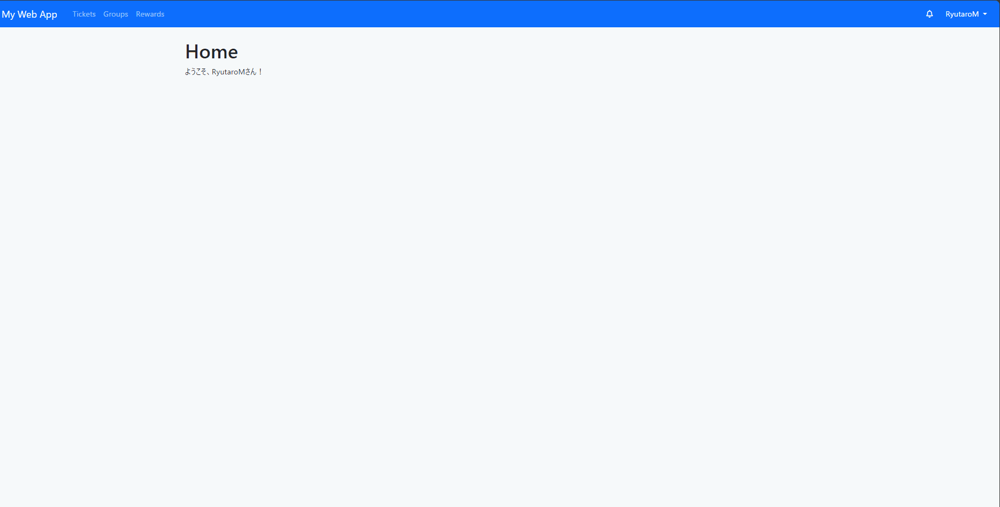

# Hi there 👋

  

  

  

## プロジェクト
### ◇[データ活用社会創成プラットフォームmdx](https://mdx.jp/about/mdx)を使った研究開発環境の整備
以下のサービスをmdxの仮想マシン上で利用できるようにした。
| サービス名 | 説明 |
|:-----|:-----|
| [SoftEther VPN](https://ja.softether.org/) | オープンソースのVPNソフトウェア。以下のサービスを関係者だけが扱えるようにするために導入した。環境構築の手順を[記事](https://qiita.com/ryutarom128/items/4bbf97ad7ff12572eb43)にまとめた。 |
| [GROWI](https://growi.org/ja/) | 社内Wiki。サーバ情報などを共有するために導入した。 |
| [NextCloud](https://nextcloud.com/) | ファイル共有システム。Googleドライブの自社サーバ版のようなもの。 |

### ◇[LCA](https://tenbou.nies.go.jp/science/description/detail.php?id=57)分析用のシミュレーションツールの開発
- React (React Flow, Jotai, MUI)
- Python (FastAPI)

## 個人・共同開発
### ◇[ゲームでキルしたタイミングを解析するツール](https://github.com/MRyutaro/splatoon3_highlight_collector)

- React
- Python(FastAPI, scikit-learn)

### ◇[カメラと両手のみを必要とする新たな入力システム](https://github.com/MRyutaro/finger_input_system)

- Python(scikit-learn)

### ◇タスク管理×報酬管理×メモアプリ

- Python(Django)
- CSS(Bootstrap)

## 記事
### ニュース
- [【Python×PDF】PyPDF2はもう古い！PythonでPDFを扱うときにはpypdfを使おう](https://qiita.com/ryutarom128/items/6e5d36efb136f9595f07)は50000viewを達成（2024年7月時点）
- [【Python×PDF】PyPDF2はもう古い！PythonでPDFを扱うときにはpypdfを使おう](https://qiita.com/ryutarom128/items/6e5d36efb136f9595f07)は40000viewを達成（2024年5月時点）

### 一覧
| 投稿日 | タイトル |
|:---|:---|
| 2024年06月03日 | [【【KVM入門⑤】〜LDAPを使ってユーザ情報などを一元管理する〜](https://qiita.com/ryutarom128/items/b008ca44b7265164879c) |
| 2024年06月02日 | [【KVM入門④】〜NFSを使って全ての仮想マシンでファイルを共有する〜](https://qiita.com/ryutarom128/items/3d66f1a5d61c3eb4e426) |
| 2024年06月02日 | [【KVM入門③】〜DNSとhostsの設定を行う〜](https://qiita.com/ryutarom128/items/7dd3646beddb96dc647a) |
| 2024年06月01日 | [【KVM入門②】〜複数の仮想マシンを作成して仮想マシン間で通信を行えるようにする〜](https://qiita.com/ryutarom128/items/2665a0f871d90f7f5358) |
| 2024年05月27日 | [【図解】SoftEther VPNを使ってLinux上でVPNサーバの環境構築をする](https://qiita.com/ryutarom128/items/4bbf97ad7ff12572eb43) |
| 2024年05月23日 | [【KVM入門①】〜KVMを使って仮想マシンを作成する〜](https://qiita.com/ryutarom128/items/a31cc4e296442cd0f9d6) |
| 2024年05月22日 | [【FastAPI×React×Nginx×Docker】フロントエンドコンテナとAPIコンテナでやり取りができないときにしたこと](https://qiita.com/ryutarom128/items/25fb64d72b4bb16e6fbf) |
| 2024年05月22日 | [【KVM入門⓪】〜Linuxの基礎知識〜](https://qiita.com/ryutarom128/items/00ed01b0c9dd59716964) |
| 2024年02月26日 | [1年間実務経験を積んできて学んだこと（2年目）](https://qiita.com/ryutarom128/items/66d3e55bc3c7fc9704a6) |
| 2023年03月13日 | [【Python×PDF】PyPDF2はもう古い！PythonでPDFを扱うときにはpypdfを使おう](https://qiita.com/ryutarom128/items/6e5d36efb136f9595f07) |
| 2023年03月09日 | [【初心者向け】OpenCV, NumPyを使ってSplatoonの解析をしてみる](https://qiita.com/ryutarom128/items/3cd338ea19fcb13ff013) |
| 2023年02月26日 | [プログラミング初心者の状態から1年間実務経験を積んできて学んだこと](https://qiita.com/ryutarom128/items/be0ccca1048592284d07) |

